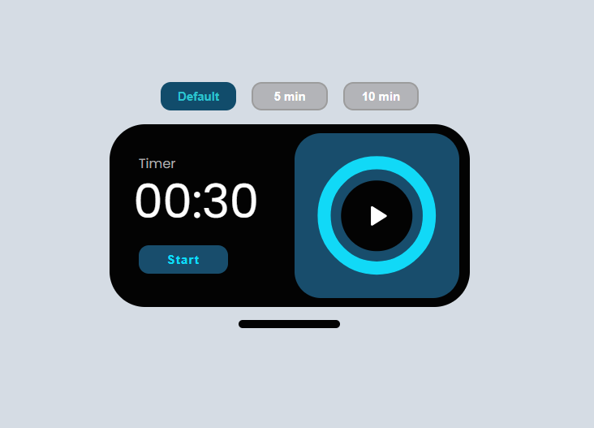

# ⏳ Aesthetic Countdown Timer

A fully animated SVG-based countdown timer built using:

- HTML
- CSS
- JavaScript
- requestAnimationFrame()

## 🚀 Live Demo
👉 https://devarch0.github.io/aesthetic_countdown-timer/

---

## ✨ Features

- Preset time buttons (Default / 5 min / 10 min)
- Smooth circular progress animation
- Pause / Resume functionality
- Dynamic Start / Stop state
- Clean UI design

---
## 🤔 Some down-side
- not responsive work, so recommended to open in laptop otherwise may affect your UI experience.

## 📸 Preview

---

## 🛠 Tech Used

- HTML5
- CSS3 (Flexbox + Animations)
- Vanilla JavaScript

---

## 📌 What I Learned

- SVG stroke animation
- State management in JS
- requestAnimationFrame()
- GitHub deployment (GitHub Pages)
